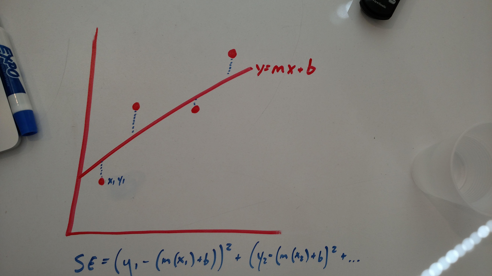
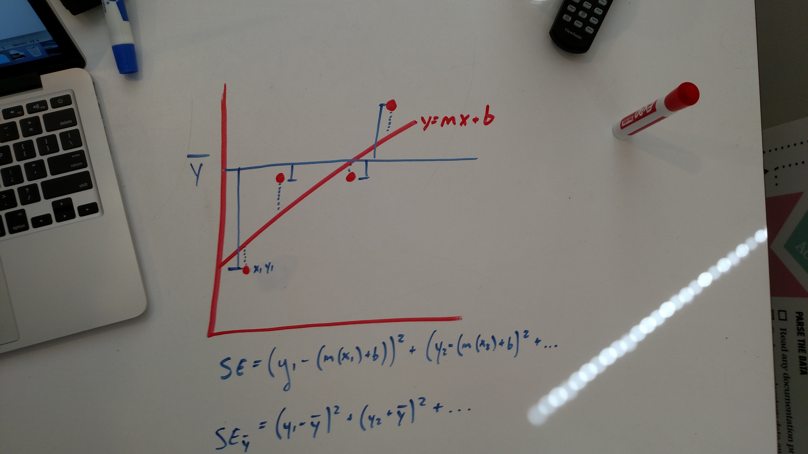
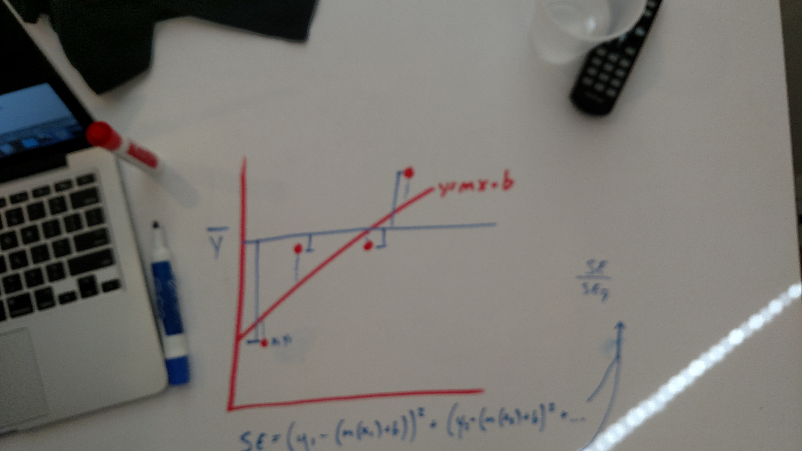
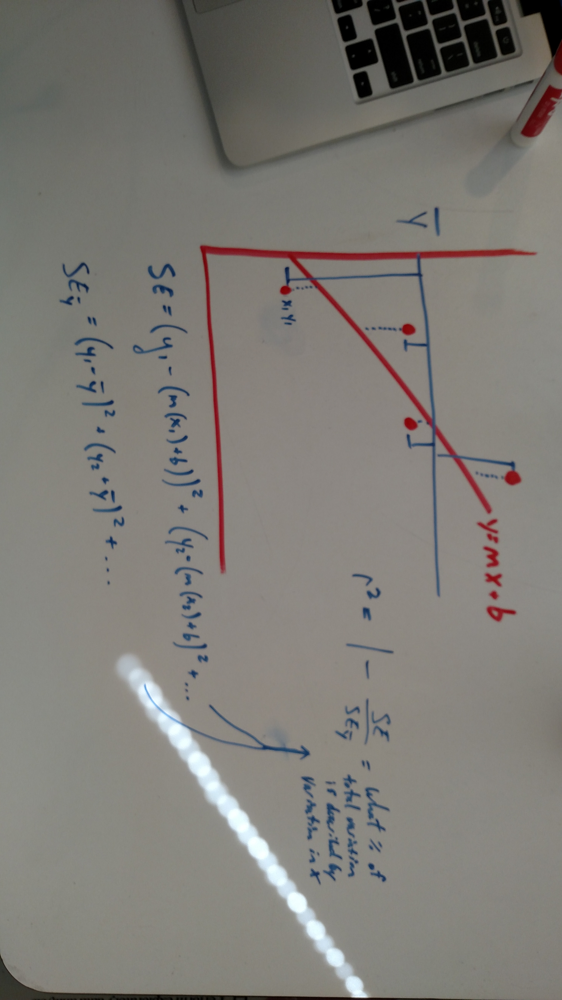

## R-squared intuitive explanation

R-squared, also known as the coefficient of determination, is the core metric to assess the accuracy of a regression model. The key idea is we're measuring how much of the variance of y is captured by the variance of X, used within our model.

Thus, we need two things: the variance of how far our predictions are from the true y values AND the variance of y itself.

We've already considered how to calculate the residual values of our model using [Mean Squared Error](https://en.wikipedia.org/wiki/Mean_squared_error). Recall that mean squared error is precisely what we're after: it's the variance of how far the true y-values are from our model itself. Visually, we're taking the distances of our true y-values AGAINST our model's predicted y-values. Our model's predicted y-values are given by, simply, the slope equation, y = mx+b. We substitute x for the corresponding true (x,y) pair we're evaluating.

# 

Now that we have the "how much our model is missing" term (mean squared error), we need to identify the total variance of y itself. To calculate [variance](https://en.wikipedia.org/wiki/Variance), we subtract each y-value from the y's mean. In this case, I've estimated the mean of y as a horizontal, blue line. Note the blue vertical lines from each point to the mean of y is measuring the variance of y.

# 

Once we have the measure of how far off our model is (the standard error of the line/MSE) and how much y varies in total (standard error of y), we can calculate how correct our model is! To do so, we place standard error of our residuals in the numerator and the total variance of y in the denominator. This is quite intuitive: we're functionally dividing the amount of standard error of our model BY the standard error of y. This, in effect, will create a percentage of how far off our model is. (Notice I did not say how CORRECT our model is--I said how far off the model is. Read on.)

# 

Now, we're so close to finding our r-squared figure. But we have to do one thing: we need to subtract our newly calculated fraction from 1. Why? Remember: the numerator of our function is how far OFF our model is, but we seek to identify how CORRECT our model is. If we calculate the percentage of much of our model does NOT explain variance, we can subtract that value from 1 to identify how much of our model DOES explain variance.

# 

## Interpreting R-squared

Let's interpret this a bit. If our model has a mean squared error of zero, we're saying our model correctly measures ALL the variance in y. Our residuals equal zero. All points fall on the line. Indeed, in this case, our r-squared is one because the numerator of our calculation is zero. When we subtract this fraction (0 divided by any variance y is going to be 0) from 1, we find an r-squared of 1. A-hah!

Does that mean a high r-squared is always better? Not necessarily! In fact, we may be systemically producing an overfit, biased model. If our model hits every single point in our dataset, the MSE drops to zero. However, our error due to variance will become excessively large. (Refer to the bias/variance tradeoff).

Low r-squared values are not necessarily bad either. In some fields, we anticipate low r-squared values. Political scientists, biologists, and sometimes even economists find tremendous value in models with low r-squared values.

## References

- [How to interpret R-squared](http://blog.minitab.com/blog/adventures-in-statistics/regression-analysis-how-do-i-interpret-r-squared-and-assess-the-goodness-of-fit)
- Khan Academy's [simple explanation](https://www.khanacademy.org/math/statistics-probability/describing-relationships-quantitative-data/residuals-least-squares-rsquared/v/r-squared-or-coefficient-of-determination) (which this closely follows)
- Duke's [linear regression guide](http://people.duke.edu/~rnau/rsquared.htm)

