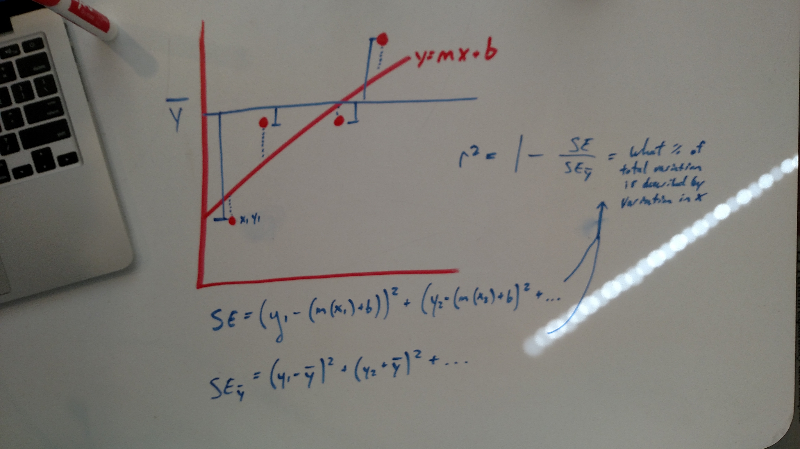

## R-squared intuitive explanation

R-squared, also known as the coefficient of determination, is the core metric to assess the accuracy of a regression model. The key idea is we're measuring how much of the variance of y is captured by the variance of X, used within our model.

Thus, we need two things: the variance of how far our predictions are from the true y values AND the variance of y itself.

We've already considered how to calculate the residual values of our model using Mean Squared Error. Recall that mean squared error is precisely what we're after: it's the variance of how far the true y-values are from our model itself. Visually, we're taking the distances of our true y-values AGAINST our model's predicted y-values. Our model's predicted y-values are given by, simply, the slope equation, y = mx+b. We substitute x for the corresponding true (x,y) pair we're evaluating.

# 

# 

# 

# 

