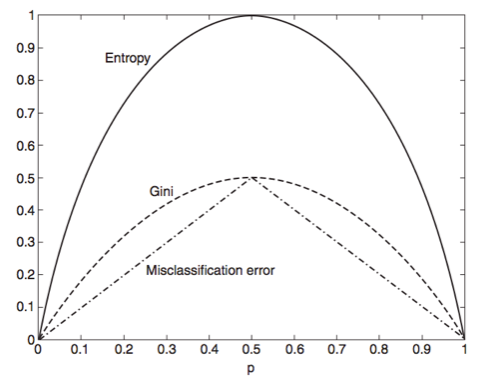

#  Intro to Classification and Regression Trees (CARTs)

### LESSON GUIDE

| TIMING  | TYPE  | TOPIC  |
|:-:|---|---|
| 5 mins | [Opening](#opening) | Opening |
| 45 min | [Introduction](#introduction) | Intro to Classification and Regression Trees |
| 10 mins | [Discussion](#discussion) | Discussion: The ID3 Algorithm for decision trees |
| 10 mins | [Guided-practice](#guided-practice) | Guided Practice: Decision trees pros and cons |
| 10 mins | [Ind-practice](#ind-practice) | Independent Practice: Decision trees as a service |
| 5 mins | [Conclusion](#conclusion) | Conclusion |

## Opening 

Last week we, we started getting into some of the meat of data science. This week, we're going to learn about tree and ensemble methods, and it all starts with it's most basic algorithm - the decision tree - otherwise known as the classification and regression tre. 

These are very powerful machine learning tools that allow us to solve complex problems in a very performant way. Also, they are easy to visualize and communicate, making them extremely powerful in a context where other (non-technical) stakeholders are involved.

## Intro to Decision Trees 

### The Intuition of Decision Trees

Decisions trees are similar to the game 20 questions. They make predictions by answering a series of questions, most often yes or no questions. What we typically want is the smallest set of questions to get to the right answer. We want each question to reduce our search space as much as possible.

Trees are a data structure made up of nodes and branches. Each node typically has two (or more) branches that connect it to it's children. Each child is another node in the tree and contains it's own subtree. Nodes without any children are known as leaf nodes.

A decision tree contains a question at every node. Depending on the answer to that question, we will proceed down the left or right branch of the tree and ask another question. Once we don't have any more questions at the leaf nodes, we make a prediction.

It's important to note the next question we ask is always dependent on the last. We'll see how this sets decision trees apart from previous models. For example, suppose we want to predict if an article is a news article. We may start by asking: does it mention a President?

- If it does, it must be a news article
- If not, let's ask another question - does the article contain other political figures?
- If not, does the article contain references to political topics?
- Etc

### Comparison to Previous Models

Decision trees have an advantage over logistic regression by being non-linear. A linear model is one in which a change in an input variable has a constant change on the output variable.

An example of this difference is the relationship between years of education and salary. We know that as education increases, salary should as well. A linear model would say this effect is constant. As your years of education goes from 10 to 15 years or 15 to 20 years, the corresponding increase in salary would be about the same. A non-linear model allows us to change the effect depending on the input. For instance, with a non-linear model you could show how the relationship of education to salary changes dramatically from 0-15 years, but neglibly from years 15-20.

Additionally, trees automatically contain interactions of features. Since each question is dependent on the last, the features are naturally interacting.

### What a Decision Tree is
_Decision trees_ are a _non-parametric hierarchical_ classification technique.

- **_non-parametric_** means that the model is not described in terms of parameters like for example Logistic Regression. It also means that there is no underlying assumption on the distribution of data and of the error. In a sense this makes _DT_ agnostic to the data.
- **_hierarchical_** means that the model consists of a sequence of questions which yield a class label when applied to any record. In other words, once trained, the model behaves like a recipe, which will tell us a result if followed exactly.

Consider the following example. Suppose I have a dataset of weather data, with 3 features: Outlook, Humidity, Wind, and a binary target variable which indicates if I should play golf on that day or not, depending on the weather. I could build a hierarchical tree of decisions like this one:

The tree gives me a precise rule to make a decision depending on the values assumed by the features.

**Check:** According to this tree, should I play golf in a day where:
- Outlook = Sunny
- Humidity = High
- Wind = Strong

Let's learn a little vocabulary. The tree is a case of _Directed Acyclical Graph (DAG)_, and as such it has _Nodes_ and _Edges_. Nodes correspond to questions or decisions, while edges correspond to possible answers to a given question.

DAG is simply a complicated way of saying: 
- **D**irected: The connections between the graph's nodes have a direction
- **A**crylic: AKA "non-cicular," we move in one direction and never encounter a single node twice
- **G**raph: A structure consisting of nodes 

The top node is also called _root node_ it has 0 incoming edges, and 2+ outgoing edges. Internal nodes test a condition on a specific feature. They have 1 incoming edge, and 2+ outgoing edges. Finally a leaf node contains a class label (or a regression value). It has 1 incoming edge and 0 outgoing edges.

### How to build a decision tree

In order to build a decision tree we need an algorithm that is capable of determining optimal choices for each node. One such algorithm is _Hunt's algorithm_: a _greedy recursive_ algorithm that leads to a _local optimum_.

- _greedy_: algorithm makes locally optimal decision at each step
- _recursive_: splits task into subtasks, solves each the same way
- _local optimum_: solution for a given neighborhood of points

The algorithm works by recursively partitioning records into smaller and smaller subsets. Like all data science techniques, we need to quantify this segregation. We can do so with any of the following metrics:

- [Classification Error]
- [Entropy]
- Gini

Each of these measures the purity of the separation. The partitioning decision is made at each node according to a metric called _purity_. A node is said to be 100% pure when all of its records belong to a single class (or have the same value).

Classification error asks: what percent are positive in each group? The lowest error would be a separation that has 100% positive in one group and 0% in the other (completely separating news stories from non-news stories.)

When training, we want to choose the question that gives us the best change in our purity measure. Given our current set of data points (articles), you could ask: what question will make the largest change in purity? We'll come back to this concept in a bit. 

At each training step, we take our current set and choose the best feature to split (in other words, the best question to ask) based on information gain. After splitting, we then have two new groups. This process is next repeated recursively for each of those two groups.

### Visual Example of a Decision Tree

Let's build a sample tree for our evergreen prediction problem. Assume our features are:

Whether the article contains a recipe
The image ratio
The html ratio

First, we want to choose the feature the gives us the highest purity. In this case, we choose the recipe feature.

Then, we take each side of the tree and repeat the process, choosing the feature that best splits the remaining samples.

As you can see the best feature is different on both sides of this tree, which shows the interaction of features. If the article does not contain 'recipe', then we care about the image_ratio, but otherwise we don't.

We can continue that process until we have asked as many questions as we want or until our leaf nodes are completely pure.

### Making Predictions from a Decision Tree

Predictions are made in the decision tree from answering each of the questions. Once we reach a leaf node, our prediction is made by taking the majority label of the training samples that fulfill the questions. If there are 10 training samples that match our new sample, and 6 are positive, we will predict positive since 6/10 (60%) are positive.

In the sample tree, if we want to classify a new article, we can proceed by first asking - does the article contain the word recipe? If it doesn't, we can check: does the article have a lot of images? If it does, 630 / 943 articles are evergreen - so we can assign a 0.67 probability for evergreen sites.

Given a set of records `Dt` at node `t`:

1. If all records in `Dt` belong to class A, then `t` is a _leaf node_ corresponding to class (Base case)
- If `Dt` contains records from both A and B do the following:
    - create test condition to partition the records further
    - `t` is an internal node, with outgoing edges to child nodes
    - partition records in Dt to children according to test

These steps are then recursively applied to each child node.

- Splits can be 2 way or multi-way. 
-Features can be categorical or continuous.

###Multi-Way Splits

###Continuous Measure Descisions

### Optimization and "Purity" 

Recall from the algorithm above, that we iteratively create **test conditions** to split the data.

How do we determine the best split among all possible splits? Recall that no split is necessary (at a given node) when all records belong to the same class. Therefore we want each step to create the partition with the **highest possible purity**.

The **maximum impurity partition** is given by the distribution:
$$
p(0|t) = p(1|t) = 0.5
$$

where both classes are present in equal manner.

On the other hand, the minimum impurity partition is obtained when only one class is present, i.e:
$$
p(0|t) = 1 – p(1|t) = 1
$$

Therefore in the case of a binary classification we need to define an _impurity_ function that will smoothly vary between the two extreme cases of minimum impurity (one class or the other only) and the maximum impurity case of equal mix.

We can define several functions that satisfy these properties. Here are three common ones:

$$
\text{Entropy}(t) = - \sum_{i=0}^{c-1} p(i|t)log_2 p(i|t)
$$

$$
\text{Gini}(t) = 1 - \sum_{i=0}^{c-1} [p(i|t)]^2
$$

$$
\text{Classification error}(t) = 1 - \max_i[p(i|t)]
$$

Note that each measure achieves its max at 0.5, min at 0 and 1.

Impurity measures put us on the right track, but on their own they are not enough to tell us how our split will do. We still need to look at impurity before & after the split. We can make this comparison using the gain:
$$
\Delta = I(\text{parent}) - \sum_{\text{children}}\frac{N_j}{N}I(\text{child}_j)
$$

Where $I$ is the impurity measure, $N_j$ denotes the number of records at child node $j$, and $N$ denotes the number of records at the parent node. When $I$ is the entropy, this quantity is called the _information gain_.

Generally speaking, a test condition with a high number of outcomes can lead to overfitting (ex: a split with one outcome per record). One way of dealing with this is to restrict the algorithm to binary splits only (CART). Another way is to use a splitting criterion which explicitly penalizes the number of outcomes (C4.5).

**Check:** what properties does an impurity measure need to satisfy?

## Discussion: The ID3 Algorithm for decision trees 

Here's the pseudo code for the ID3 decision tree algorithm:

    ID3 (Examples, Target_Attribute, Candidate_Attributes)
        Create a Root node for the tree
        If all examples have the same value of the Target_Attribute,
            Return the single-node tree Root with label = that value
        If the list of Candidate_Attributes is empty,
            Return the single node tree Root,
                with label = most common value of Target_Attribute in the examples.
        Otherwise Begin
            A ← The Attribute that best classifies examples (most information gain)
            Decision Tree attribute for Root = A.
            For each possible value, v_i, of A,
                Add a new tree branch below Root, corresponding to the test A = v_i.
                Let Examples(v_i) be the subset of examples that have the value v_i for A
                If Examples(v_i) is empty,
                    Below this new branch add a leaf node
                        with label = most common target value in the examples
                Else
                    Below this new branch add the subtree
                        ID3 (Examples(v_i), Target_Attribute, Attributes – {A})
        End
        Return Root

Let's go through it together. How would you implement that in python? Which data structure would you use?

> Answer:
- there are several ways to implement this. A simple way is to implement a function that returns a trained tree. The tree itself could be a dictionary or a custom class. See [here](https://github.com/gumption/Python_for_Data_Science/blob/master/4_Python_Simple_Decision_Tree.ipynb), [here](http://codereview.stackexchange.com/questions/109089/id3-decision-tree-in-python) and [here](http://kldavenport.com/pure-python-decision-trees/) for examples of code.

## Decision Trees part 2 

**Check:** What is overfitting? Why do we want to avoid it?
> Answer: Overfitting occurs when a statistical model describes random error or noise instead of the underlying relationship. Overfitting generally occurs when a model is excessively complex, such as having too many parameters relative to the number of observations. A model that has been overfit will generally have poor predictive performance, as it can exaggerate minor fluctuations in the data.

### Preventing overfitting

In addition to determining splits, we also need a stopping criterion to tell us when we’re done. For example, we can stop when all records belong to the same class, or when all records have the same attributes. This is correct in principle, but would likely lead to overfitting. One possibility is _pre-pruning_, which involves setting a minimum threshold on the gain, and stopping when no split achieves a gain above this threshold. This prevents overfitting, but is difficult to calibrate in practice (may preserve bias!). Alternatively we could build the full tree, and then perform _pruning_ as a post-processing step. To prune a tree, we examine the nodes from the bottom-up and simplify pieces of the tree (according to some criteria). Complicated subtrees can be replaced either with a single node, or with a simpler (child) subtree. The first approach is called subtree replacement, and the second is subtree raising.

### Decision tree regression

In the case of regression, the outcome variable is not a category but a continuous value. We cannot therefore use the same measure of purity we used for classification. Instead we will use the following variation of the algorithm:

At each node calculate the variance of the data points at that node, then choose the split that generates the largest decrease in total variance for the children nodes. In other words we use variance as our measure of impurity and we want to maximize the decrease of total variance at each split.

In a regression tree the idea is this: since the target variable does not have classes, we fit a regression model to the target variable using each of the independent variables. Then for each independent variable, the data is split at several split points. At each split point, the "error" between the predicted value and the actual values is squared to get a sum of squared errors (SSE). The split point errors across the variables are compared and the variable/point yielding the lowest SSE is chosen as the root node/split point. This process is recursively continued.

## CART Advantages and Disadvantages

### CART Advantages

- Simple to understand and interpret. People are able to understand decision tree models after a brief explanation.
- Useful to work with non technical departments (marketing/sales).
- Requires little data preparation.
- Other techniques often require data normalization, dummy variables need to be created and blank values to be removed.
- Able to handle both numerical and categorical data.
    - Other techniques are usually specialized in analyzing datasets that have only one type of variable.
- Uses a white box model.
    - If a given situation is observable in a model the explanation for the condition is easily explained by boolean logic.
    - By contrast, in a black box model, the explanation for the results is typically difficult to understand, for example in neural networks.
- Possible to validate a model using statistical tests. That makes it possible to account for the reliability of the model.
- Robust. Performs well even if its assumptions are somewhat violated by the true model from which the data were generated.
- Performs well with large datasets. Large amounts of data can be analyzed using standard computing resources in reasonable time.
- Once trained can be implemented on hardware and has extremely fast execution.
    - Real-time applications like trading, for example.

### CART Disadvantages

- Locally-optimal
    - Practical decision-tree learning algorithms are based on heuristics such as the greedy algorithm where locally-optimal decisions are made at each node.
    - Such algorithms cannot guarantee to return the globally-optimal decision tree.
- Overfitting
    - Decision-tree learners can create over-complex trees that do not generalize well from the training data.
- There are concepts that are hard to learn because decision trees do not express them easily, such as XOR, parity or multiplexer problems. In such cases, the decision tree becomes prohibitively large.
    - **Neural networks**, for example, are superior for these problems.
- Decision tree learners create biased trees if some classes dominate. It is therefore recommended to balance the dataset prior to fitting with the decision tree.

## Independent Practice: Decision trees as a service 

There are several companies that offer decision trees as service. Two famous ones are BigML and WiseIO. Let's split the class in 2. One half will look at BigML case studies and the other half will look at WiseIO case studies.

- [BigML](https://bigml.com/gallery/models)
- [WiseIO](http://www.wise.io/resources)

Review a few of them with your team mates and choose one that you find particularly interesting. Then present it to the other group.

## Conclusion 

In this class we learned about Classification and Regression trees. We learned how Hunt's algorithm helps us recursively partition our data and how impurity gain is useful for determining optimal splits.
We've also reviewed the pros and cons of decision trees and industry
applications. In the next class we will learn to use them in `Scikit-learn`.

### ADDITIONAL RESOURCES

- [Decision trees on wikipedia](https://en.wikipedia.org/wiki/Decision_tree_learning)
- [Decision tree regression explained](http://www.saedsayad.com/decision_tree_reg.htm)
